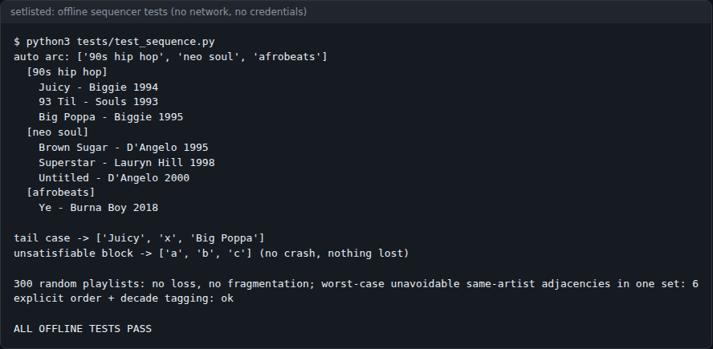
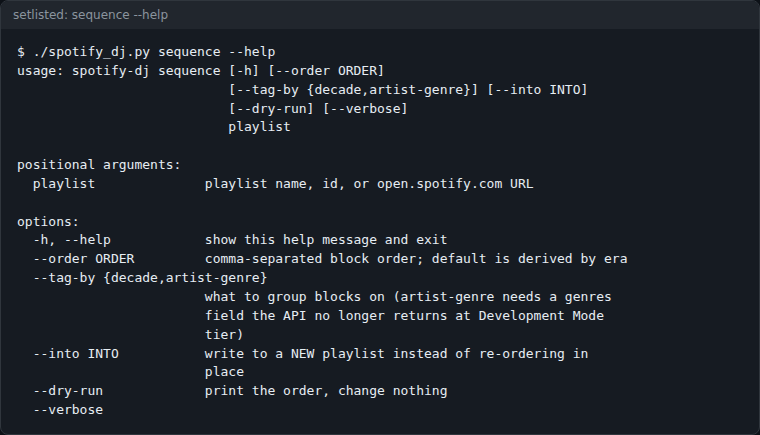
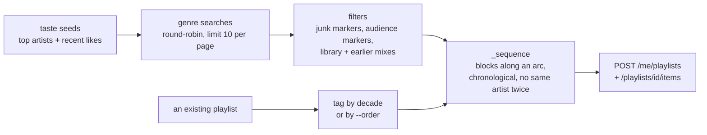

# setlisted

A headless Spotify CLI for a server or a cron job: discovery mixes that don't repeat week to week,
hour-targeted event sets, and playlist flow sequencing from metadata alone, written against the
post-February-2026 Web API.



*`python3 tests/test_sequence.py` from a fresh clone, 2026-10-08. No network and no credentials. Note
"Big Poppa" sitting after "93 Til": the same-artist rule beats strict chronology.*


## Contents

- [What it does](#what-it-does)
- [Screenshots](#screenshots)
- [Quick start](#quick-start)
- [Usage](#usage)
- [Configuration](#configuration)
- [How it works](#how-it-works)
- [The Spotify API changes it works around](#the-spotify-api-changes-it-works-around)
- [Status, limits and real results](#status-limits-and-real-results)
- [Licence and credits](#licence-and-credits)

## What it does

- **Playback** from the terminal: `play`, `pause`, `next`, `prev`, `volume`, `queue`, `devices`, `status`.
- **`weekly-mix`**: a discovery playlist seeded from your top artists and recent likes, which excludes
  your library, your top tracks and every track from earlier mixes, so it doesn't rebuild the same
  playlist each week.
- **`party-set`**: a clean set for an event, targeted at hours of audio rather than a track count,
  sequenced as an arc. Explicit tracks, anything over 7 minutes and anything under 90 seconds are dropped.
- **`sequence`**: re-orders any playlist you own (or writes a sequenced copy) into blocks along an arc,
  using only release dates, artists and tags.
- **`new-artists`**: recent releases by artists who aren't already in your top artists or likes.
- Filters search junk: tracks titled the same as the genre, `type beat`, karaoke and soundalike uploads.
- One dependency (`requests`), no SDK, no third-party OAuth broker. Credentials stay on your box.

## Screenshots



*`./spotify_dj.py sequence --help`. It takes a playlist name, id, `spotify:playlist:` URI or
`open.spotify.com` URL.*

## Quick start

You need Python 3, a Spotify account, and **Spotify Premium** for playback control (search and playlist
building don't need it).

```bash
git clone https://github.com/casareanderson/setlisted && cd setlisted
pip install -r requirements.txt
python3 tests/test_sequence.py        # offline; ends with ALL OFFLINE TESTS PASS
```

Then connect it to Spotify:

1. Create an app at <https://developer.spotify.com/dashboard>, tick **Web API**, and set the redirect URI
   to `http://127.0.0.1:8888/callback`.
2. Put the credentials in `~/.spotify-dj.env`:

   ```
   SPOTIFY_CLIENT_ID=...
   SPOTIFY_CLIENT_SECRET=...
   ```

3. Authorise once. The browser lands on a dead `127.0.0.1` page, which is expected. Copy the whole URL
   from the address bar:

   ```bash
   ./spotify_dj.py auth-url          # open this, approve
   ./spotify_dj.py auth-exchange "http://127.0.0.1:8888/callback?code=..."
   ```

   Add the printed refresh token to the same file as `SPOTIFY_REFRESH_TOKEN=`.

Success looks like `./spotify_dj.py devices` listing your Spotify Connect devices.

## Usage

```bash
# playback
./spotify_dj.py play "boom bap" --device Kitchen
./spotify_dj.py devices | status | pause | next | prev | volume 40 | queue "Four Tet"

# a weekly discovery mix that never repeats itself
./spotify_dj.py weekly-mix "Week of 28 Aug" --audience me --limit 30

# a 6-hour clean set for an event, sequenced as an arc
./spotify_dj.py party-set "Garden party" --hours 6 --exclude-artists "Artist A, Artist B"

# artists you don't already listen to, released recently
./spotify_dj.py new-artists --since 2025 --per-genre 5

# sequence a playlist you already have (any playlist you own)
./spotify_dj.py sequence "Sunday Long Drive" --dry-run          # print the order, change nothing
./spotify_dj.py sequence "Sunday Long Drive"                    # re-order in place
./spotify_dj.py sequence https://open.spotify.com/playlist/xxxx --into "Long Drive (sequenced)"
./spotify_dj.py sequence "Block Party" --order "soul, jazz rap, 90s hip hop, afrobeats"
```

Useful flags on `weekly-mix`: `--genres` (comma-separated, replaces the tuned default list),
`--allow-known` (don't exclude library tracks), `--no-taste` (genres only), `--no-flow` (don't sequence),
`--allow-repeats` (don't exclude earlier mixes). Run any command with `--help` for the rest.

**Running it weekly.** `weekly-mix.sh` builds two mixes (`--audience me` and `--audience kids`) and prints
a short summary for a cron mailer or a chat bot. It calls `./spotify_dj.py`, so run it from the repo:

```bash
30 8 * * 1  cd /path/to/setlisted && bash weekly-mix.sh
```

## Configuration

Values resolve in this order: environment, then `~/.spotify-dj.env`, then an optional secrets backend
(drop in a `hermes_secrets.py` and point `HERMES_AGENT_DIR` at its directory).

| name | default | what it does |
|---|---|---|
| `SPOTIFY_CLIENT_ID` | none | your Spotify app's client id |
| `SPOTIFY_CLIENT_SECRET` | none | your Spotify app's client secret |
| `SPOTIFY_REFRESH_TOKEN` | none | printed by `auth-exchange`; used to mint access tokens |
| `SPOTIFY_REDIRECT_URI` | `http://127.0.0.1:8888/callback` | must match the app's redirect URI |
| `SPOTIFY_ENV_FILE` | `~/.spotify-dj.env` | where the credentials file lives |
| `SPOTIFY_TOKEN_CACHE` | `~/.spotify-dj-token.json` | access-token cache |
| `SPOTIFY_SECRET_PATH` | `/Spotify` | folder used when reading from the secrets backend |
| `HERMES_AGENT_DIR` | `/opt/hermes-agent` | where to look for the optional `hermes_secrets.py` |

The genre lists and arcs are plain Python lists near the top of `spotify_dj.py`: `FLOW_ARC` for mixes,
`PARTY_ARC` for event sets, `JUNK_MARKERS` for the search filter and `KIDS_MARKERS` for the audience split.

## How it works



**Discovery without a recommendations API.** `/recommendations` is gone, and `year:` / `genre:` search
filters returned zero results at this tier, so era and style come from the search phrasing alone.
`weekly-mix` searches a genre list round-robin, so every genre is represented rather than the first two
eating the whole limit. It then drops your liked library, your top tracks and everything from previous
mixes (playlists whose names start with `setlisted`, or `Hermes DJ` from before the rename).

**Sequencing from metadata.** Tempo, energy and key were removed from the public API in November 2024,
and `popularity` in February 2026. What's left is a tag, a release date, a duration and an artist.
`_sequence(tracks, order=[...])` is genre-agnostic: the tag is a label (a genre, a mood, a decade), and
blocks come out in the order you pass, so the arc is the order you list your tags in. Three rules:

1. **Group into blocks, never alternate.** Round-robin picks a balanced set but sequences badly.
2. **Chronological within a block**, so it reads as a run through an era.
3. **No same artist back to back**, de-duplicated *inside* the block so the arc isn't fragmented.

Where rules 2 and 3 collide (a block ending in two tracks by one artist, with nothing ahead to swap
with), rule 3 wins and one track moves backwards by the shortest distance that separates them. Some blocks
can't be fixed (three tracks, one artist); it does the best it can.

**Why `sequence` tags by decade by default.** A track has no genre of its own on the API, so the obvious
move is to read the genre off its artist. Measured on 28 Aug 2026 on a Development Mode app, that no longer
works: the batch `GET /artists?ids=` returns 403, and `GET /artists/{id}` returns an object with no
`genres` key at all. So the default block tag is the release decade. `--tag-by artist-genre` is kept in
case the field comes back, and it **fails with an error** rather than tagging everything `unknown`.
Without `--order`, blocks are sorted by median year, oldest first, ties breaking on block size.

In-place re-ordering is a single `PUT /playlists/{id}/items`, so the playlist is never left half-empty
if a run dies midway.

**The `--audience` split.** One marker list (`KIDS_MARKERS`) **excludes** for `--audience me` and
**selects** for `--audience kids`, where explicit tracks are also dropped. It exists because on a shared
family account `/me/top/*` is full of nursery rhymes and sleep sounds. Add specific act names to the
list rather than broadening the markers: broad terms wrongly caught a reggae artist and a guitarist.

**Event sets.** `party-set` inverts the discovery rules: familiarity is a feature, so it does *not*
exclude your library. The default arc (`PARTY_ARC`) runs arrival, celebration, build, lift and peak across
soul, motown, lovers rock, roots reggae, gospel, rnb, highlife, hiplife, afrobeats, azonto, amapiano,
reggae and dancehall. It leans Afro-Caribbean because that's what it was built for; replace it with
`--genres`.

```
spotify_dj.py          the whole CLI: auth, playback, search, filters, mixes, sequencer
weekly-mix.sh          cron wrapper: two weekly mixes, short summary, non-zero exit on failure
tests/test_sequence.py offline sequencer tests (fixtures + 300 seeded random playlists)
requirements.txt       requests
docs/index.html        GitHub Pages page
docs/img/              README images
```

## The Spotify API changes it works around

Two separate events. Don't conflate them.

**27 Nov 2024** removed, for every app without an existing quota extension: `/recommendations`,
`/audio-features`, `/audio-analysis`, `/related-artists`, `/browse/featured-playlists`, and 30-second
preview URLs. *This* is when playlist sequencing on the public API died.

**Feb 2026** was a rename-and-trim migration (enforced 11 Feb for new integrations, 9 Mar for existing
ones):

| removed / renamed | use instead |
|---|---|
| `POST/PUT/GET/DELETE /playlists/{id}/tracks` | `/playlists/{id}/items` |
| `POST /users/{user_id}/playlists` | `POST /me/playlists` |
| library ops on `/me/tracks`, `/me/albums` ... | `PUT\|DELETE /me/library` (takes URIs) |

It also stripped `popularity`, `available_markets`, `followers` and `external_ids` from responses, cut the
`/search` `limit` from a maximum of 50 to **10** (default 20 to 5), started requiring Premium on the
registering account, and dropped dev-mode test users from 25 to 5.

**Removed endpoints return `403 Forbidden`, not `404`.** A renamed path looks like a permissions error, so
you go hunting through scopes. The two messages tell them apart:

- `{"message": "Insufficient client scope"}`: a real scope problem.
- `{"message": "Forbidden"}` (bare): the endpoint is gone. Check the path.

The bare `Forbidden` arrives before body validation: an empty body or a malformed URI returns 403 rather
than 400, which is how you can prove it's the route and not your request.

**The row field was renamed too.** Each playlist item used to carry its track under `"track"`; it is now
`"item"`, and `"track"` survives as a **boolean**. Read the old key and you get `True`, not a track:

```python
t = item.get("item") or item.get("track")   # new key first, old as fallback
if not isinstance(t, dict):
    continue
```

**Extended Quota Mode is not a workaround.** It's gated at 250k monthly active users, so it's closed to
individuals. You don't need it for playback or playlist writes.

## Status, limits and real results

The tool the author uses for Spotify on a headless box. For this README only the offline tests and
`--help` were re-run (2026-10-08); no live Spotify calls were made.

- The offline tests pass from a fresh clone (2026-10-08): fixtures, the tail case, an unsatisfiable block,
  and 300 seeded random playlists with no track lost or duplicated and no block fragmented. The worst
  unavoidable same-artist adjacency count in one random set was 6.
- The `/artists` findings above were measured on 28 Aug 2026 on a Development Mode app.
- Metadata-only sequencing is **weaker** than real BPM and energy sequencing. It is what's left when that
  data is gone, not a replacement for it. If you run the Spotify desktop client,
  [sort-play](https://github.com/hoeci/sort-play) (Spicetify) reaches real audio features and is the better
  tool. This one is for headless use.
- The playback part is commoditised: there are several maintained Spotify CLIs and MCP servers. The parts
  without obvious prior art on the public API are metadata-only flow sequencing, the anti-SEO junk filter
  (one junk result costs 10% of a 10-result page) and cross-mix de-duplication.
- `--tag-by artist-genre` fails on Development Mode apps, on purpose, until Spotify returns the field.
- The API has a daily quota that a few heavy runs can exhaust; the sequencer tests avoid it entirely.

The February 2026 changes are written up in full, with the misleading response codes, in
[The Spotify API, After the Break](https://asareanderson.gumroad.com/l/taeoza) and a
[2-page cheat sheet](https://asareanderson.gumroad.com/l/yigsxw).

## Licence and credits

MIT. See [LICENSE](LICENSE).

- Data from the [Spotify Web API](https://developer.spotify.com/documentation/web-api). setlisted is not
  affiliated with Spotify.
- Tempo (BPM) and key data credit: [GetSongBPM](https://getsongbpm.com/api). The code in this repo does
  not call the GetSongBPM API yet; the sequencer works from Spotify metadata only.
- [requests](https://requests.readthedocs.io/) (Apache-2.0).
